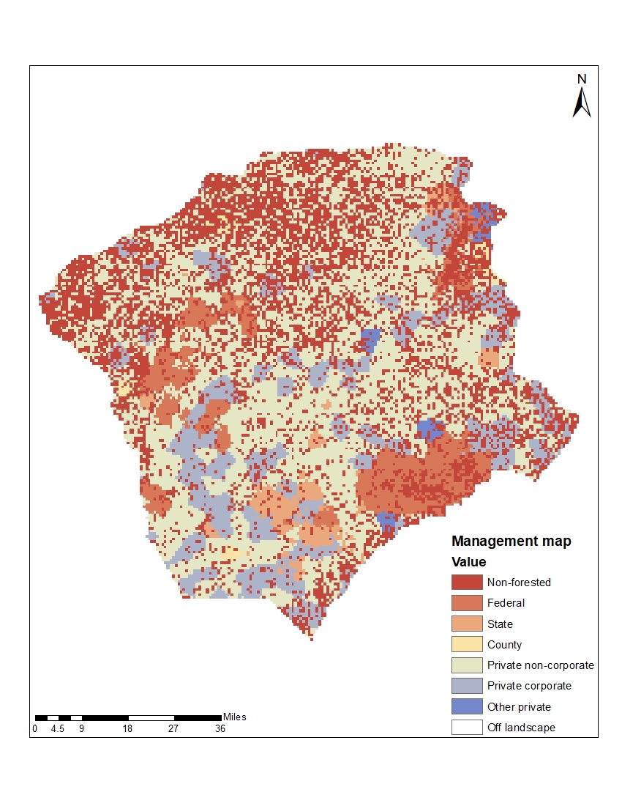

### Biomass Harvest

The Biomass Harvest extension simulates forest management by selecting and removing tree species biomass based on specific management prescriptions that specify the timing of harvest, the species harvested, the amount of biomass removed, and the species planted (Gustafson et al. 2000). 

#### Management and stand maps
Maps of management areas and forest stands determine where harvesting occurs on the landscape. 

To create the management map, we divided the study area into management units based on the land ownership types described in Forest Service Forest Ownership Types in the 
Conterminous US map (https://www.fs.fed.us/nrs/pubs/rmap/rmap_nrs6.pdf). This map was reprojected to the extent of my study area.

Management map for my study area

We then further subdivided the landscape into forest stands for the forest stand map using an extensive map of roads and streams. I originally only subdivide by major roads and 
streams layers but this yielded stands that were far too large. I had to redo the subdivision, this time by all roads and all streams on my landscape to create smaller stands. 
The roads layer was from the North Carolina Department of Transportation's NCRouteCharacteristics data layer. The streams layer was from the NC OneMap Major Hydrography dataset. 
This subdivision was done in ArcGIS and then had to be reprojected in R similar to the management area map. Stand size was validated with data from Rajan Parajuli- NC-wide land 
and forest holdings data from the 2018 National Woodland Owner Survey (https://www.fia.fs.fed.us/nwos/results/).

Comparison of Rajan's stand data and my simulated stand sizes

#### Management in the study area
Management prescriptions allow the user to specify how a stand is harvested (e.g., thinning or clearcut), how much of each species-age cohort is harvested, and whether the stand 
is replanted after harvesting, among other prescription criteria. The amount of the landscape harvested in each management area/prescription combination for each time step is 
determined by the rotation period (Gustafson et al. 2000). 

We originally decided on two harvest prescriptions: (1) loblolly pine clearcutting for family and private industrial forests and (2) hardwood thin and a cut to simulate 
prescribed burning in the longleaf pine forests of Ft. Bragg and other private (conservation and natural resource agency) lands. Additionally I created a prescription to 
simulate mixed forest thinning that occasionally happens on private land (3rd prescription). I used eVALIDator data (https://apps.fs.usda.gov/Evalidator/evalidator.jsp organized 
by county, land owner, and species group for a rough baseline of  how much loblolly pine was being harvested on my landscape each year from 2004-2014. I then assumed that most 
of the 32,500 hectares of private industrial forest are being harvested on a 30 year rotation so made my target 1080 hectares per year, 3240 hectares per harvest time step.

Family private loblolly harvesting, and forestry practices in general, have been the hardest to nail down. I emailed Mark Megalos of the Forestry Cooperative Extension to get 
his perspective on how much family forest land was actively harvested and he, in turn, sent the email out to 5 or 6 of his colleagues. The responses came back any from 20%-90% 
of family forests are actively harvested. After this response I decided to break down private family forestry into two categories:
Of 105173 private family hectares, did a rough calculation to determine that 2/5 of them are loblolly plantation or some pine mix and 3/5 are mixed forest.
Off the 2/5 that are loblolly or pine mix (42,069 ha), assumed that 75-85% is being harvested which falls within the estimates solicited from Mark Megalos and friends = ~33,000-
34,000 = 1,133 ha per year = 3,400 per time step. Of the 3/5 of mixed forest (63,103 ha) assumed 5% thinned annually = 3,155 ha per year = 9,465 ha harvested per time step

In working with Ft. Bragg for his Dept. of Defense project, Rob knew that roughly 2500 acres were being prescribed burned on this landscape every year. My harvest time step is 
set to 3 years to mimic the approximate prescribed burn interval that Ft. Bragg usually adheres to. 2500 acres = 1011 hectares * 3 years = 3033 hectares per harvest time step 
which is ~5% of the landscape (ft. Bragg is 163,000 acres = 65964 hectares). Just over 1.5% of Ft. Bragg is harvested every year but keep in mind, a good chunk of Ft. Bragg is 
containment area or populated.

A small amount of the landscape, 2032 hectares, is listed as other private land ownership, usually referring to conservation or natural resource agency possession. Of this land, 
about half of it is in the sandhills. Prescribed burns in this area are usually done on a smaller scale, burns at the size of 5-150 acres usually. I took an educated guess after 
talking with Liz Kallies at TNC that ~85 hectares of this land is burned any given year, which is 4% of the total other private land. 255 ha per time step. I adjusted the 
Harvest Area percentages until the outputs reflected actual harvesting regimes on the landscape (use myharvestcomparison.R script ; also Harvest_targets.csv file).

#### Management prescriptions
For the loblolly clearcut, longleaf thin/burn, longleaf restoration, and hardwood restoration prescriptions, stands were ranked on an index of economic value. With economic 
ranking, stands that most closely meet the economic criteria specified by the user are the first to receive that management prescription. In the loblolly clearcut prescription, 
stands with loblolly pine of at least 25 years old were assigned the highest economic value and targeted for harvest. In the longleaf thin/burn and longleaf restoration 
prescriptions, stands with longleaf pine of any age were prioritized for management. In the hardwood restoration prescription, stands with red maple and white oak 20 years or 
older were ranked highest for restoration. The mixed forest thinning and pine mix restoration prescriptions selected stands at random for management that had any combination of 
species besides longleaf pine and any combination of pine species besides loblolly pine, respectively. The number of hectares that each management prescription was applied to at 
each time step was validated against eVALIDator data, with expert opinion, and through speaking to land managers actively working in the study area. The Biomass Harvest 
extension operated at a 3-year time step.

Management prescription table

Citations:

Gustafson EJ, Shifley SR, Mladenoff DJ, Nimerfro KK, He HS. 2000. Spatial simulation of forest succession and timber harvesting using LANDIS. Canadian Journal of Forest Research 
30:32-43.

North Carolina Department of Environmental Quality. MajorHydro dataset. https://data-ncdenr.opendata.arcgis.com/datasets/2a5324f732bb44d9a1ca29f1c17370ee_0

North Carolina Department of Transportation. NC Route Characteristics dataset. https://connect.ncdot.gov/resources/gis/Pages/GIS-Data-Layers.aspx
