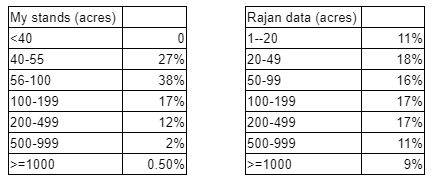

### Biomass Harvest

The Biomass Harvest extension simulates forest management by selecting and removing tree species biomass based on specific management prescriptions that specify the timing of harvest, the species harvested, the amount of biomass removed, and the species planted (Gustafson et al. 2000). 

#### Management and stand maps
Maps of management areas and forest stands determine where harvesting occurs on the landscape. 

To create the management map, we divided the study area into management units based on the land ownership types described in Forest Service Forest Ownership Types in the 
Conterminous US map (https://www.fs.fed.us/nrs/pubs/rmap/rmap_nrs6.pdf). This map was reprojected to the extent of my study area.

Management map for my study area

We then further subdivided the landscape into forest stands for the forest stand map using an extensive map of roads and streams. I originally only subdivide by major roads and 
streams layers but this yielded stands that were far too large. I had to redo the subdivision, this time by all roads and all streams on my landscape to create smaller stands. The 
roads layer was from the North Carolina Department of Transportation's NCRouteCharacteristics data layer. The streams layer was from the North Carolina DEQ Division of Water 
Resources Major Hydrography dataset. This subdivision was done in ArcGIS and then had to be reprojected in R similar to the management area map. Stand size was validated with data 
from Rajan Parajuli- NC-wide land and forest holdings data from 2017-2018 from NWOS survey.

Comparison of Rajan's stand data and my simulated stand sizes

#### Management prescriptions
The Biomass Harvest extension selects and removes tree species biomass based on specific management prescriptions that specify the timing of harvest, the species harvested, and 
the amount of biomass removed (Gustafson et al. 2000). These management prescriptions allow the user to specify how a stand is harvested (e.g., thinning or clearcut), how much 
of each species-age cohort is harvested, and whether the stand is replanted after harvesting, among other prescription criteria. Maps of management areas and forest stands 
determine where harvesting occurs on the landscape. Stands are ranked based on user-defined characteristics (for example, based on the economic values of the species-age cohorts 
in that stand) and selected for harvest according to their rank. The amount of the landscape harvested in each management area/prescription combination for each time step is 
determined by the rotation period (Gustafson et al. 2000). 

For the loblolly clearcut, longleaf thin/burn, longleaf restoration, and hardwood restoration prescriptions, stands were ranked on an index of economic value. With economic 
ranking, stands that most closely meet the economic criteria specified by the user are the first to receive that management prescription. In the loblolly clearcut prescription, 
stands with loblolly pine of at least 25 years old were assigned the highest economic value and targeted for harvest. In the longleaf thin/burn and longleaf restoration 
prescriptions, stands with longleaf pine of any age were prioritized for management. In the hardwood restoration prescription, stands with red maple and white oak 20 years or 
older were ranked highest for restoration. The mixed forest thinning and pine mix restoration prescriptions selected stands at random for management that had any combination of 
species besides longleaf pine and any combination of pine species besides loblolly pine, respectively. The number of hectares that each management prescription was applied to at 
each time step was validated against eVALIDator data, with expert opinion, and through speaking to land managers actively working in the study area. The Biomass Harvest 
extension operated at a 3-year time step.

Management prescription table

