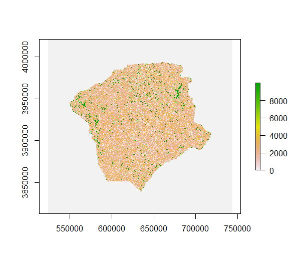

### Initial communities file creation

We initialized LANDIS-II with current forest conditions including tree species-age cohorts assigned to every forested cell. To do this, we combined Forest Inventory and Analysis 
data with Forest Service imputation maps of tree species basal area (Wilson et al. 2013). This combined approach was necessary because FIA, while highly detailed, is not 
contiguous and publicly accessible FIA data is fuzzed (locations are exchanged within a county) which can provide false spatial relations between trees. Meanwhile, imputation 
data lacks the detail required in the intial communities map, including tree species ages and biomass. Imputation maps can estimate the amount of each tree species expected at 
each location, but often lack the more detailed data needed for stand age and biomass. Combining the strengths of both data sources, we used the spatial estimations provided by 
imputation data and associated them with current and recent FIA plot data to take advantage of their more robust data. To create a contiguous spatial distribution of our focal 
species and their relative densities, we cropped the Wilson et al. (2013) raster maps of our individual species down to our study extent and extracted the tree species total 
basal area for each cell on the landscape. Because LANDIS-II requires age and biomass data to simulate initial forest conditions, we matched FIA plots to tree species 
compositions in each cell using Sorenson’s correlation coefficient and imputed them across the landscape. We used the allometric site index curves from Carmean, Hahn, and Jacobs 
(1989) to estimate the age of each tree. We then binned trees into species-age cohorts at each cell. 

#### Methods
The Forest Service imputation maps used can be found at https://www.fs.usda.gov/rds/archive/Product/RDS-2013-0013. These maps were created combining MODIS imagery with 
environmental variables, using a k-nearest neighbor and canonical correspondence analysis to estimate the abundance and distribution of each species at a 250 m pixel size (Wilson 
et al. 2013).

First, imputation maps for every modeled species were reprojected and cropped to the study area. 

Next, we did an association by species basal area to match FIA plots to tree species compositions based on Wilson et al. (2013) in each cell. We compared two different 
associations: 

Bray Curtis: 1 − ((2Cij)/S**i + S**j)

where C is the Basal area of species in common between the two sites and S is the total basal area at each site.

And Sorensens: $\frac{2*\sum(min(aij+bij))}{Si+Sj}$

The two least dissimilar plots are assigned to one another. This process is repeated for each raster cell.

The output of these assocations were compared to the FIA and Imputed data we have on species composition. Because the associations select the least dissimilar plot, there is a 
possibility for the inclusion or exclusion of species in the association. The Sorensen's plots were the most similar in terms of species assemblage to both the FIA and imputed 
maps so we used Sorensen's for our IC map creation.

AFter association FIA plots with each raster cell, we used data from FIA to get age and carbon using the Carmean, Hann, and Jacobs (1989) site index curves to associate age with 
height and site index. Each species has unique parameters to its growth curve, which is used with its height and site index to estimate its age. Now 
each tree in each plot will have age and carbon necessary to build the cohorts at each location.

$AgeT=(1/c_3)*ln[1-\frac{HT}{c1*SI^{c2}}]^{(\frac{1}{c4})*(SI^{c5})}$

Once we have this age assigned to each stand, we can use the FIA calculation of above ground carbon to estimate biomass (2x carbon). TO do this, we multipled FIA above ground 
carbon by FIA Growing trees per acre multiplier, convert it from ft2 per acre to g/m2 and multiply it by two to represent above ground biomass.

Comparison of LANDIS-II modeled IC biomass (thinner line) to FIA biomass (thicker black dotted line)

This results in the final intial communities map:

Difference in LANDIS-II IC biomass and Wilson et al. (2013) biomass estimates:

Citations: 
Wilson, B.T., Lister, A.J., Riemann, R.I., Griffith, D.M. (2013.) Live tree species basal area of the contiguous United States (2000-2009). Newtown Square, PA: USDA 
Forest Service, Rocky Mountain Research Station. https://doi.org/10.2737/RDS-2013-0013
Carmean, W. H., Hahn, J. T., & Jacobs, R. D. (1989). Site index curves for forest tree species in the eastern United States. General Technical Report NC-128. St. Paul, MN: US 
Dept. of Agriculture, Forest Service, North Central Forest Experiment Station, 128.

