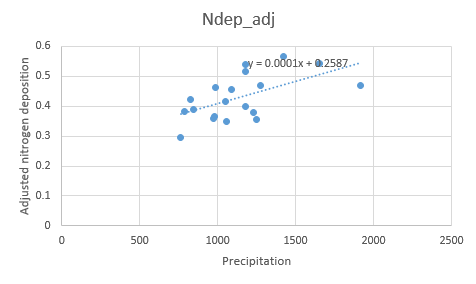

### NECN Succession extension

#### Species parameterization
Species values including C:N ratios and lignin parameters were derived from existing LANDIS-II papers and supplemented with values from the TRY database (Adler et al. 2014, 
Burns and Honkala 1990, De Jager et al. 2017, Green 2009, He et al. 2011, He et al. 2012, Iversen et al. 2017, Kattge et al. 2009, Kattge et al. 2020, Martin et al. 2015, 
Scheller et al. 2011, White et al. 2000, Wirth et al. 2009, Wright et al. 2004, Wright et al. 2006). Try data was queried by species and by trait and in the event of multiple 
returns, values were averaged. GGDmin, GDDmax, frost, leaf longevity, and max drought, were taken from the original linkages manual which can be found at 
https://daac.ornl.gov/daacdata/model_archive/LINKAGES/comp/ORNL_TM-9519.pdf and existing LANDIS-II papers. Species that could not be found using the above approches were adapted 
from a qualitative assessment of range in comparison to known values for other species. Data sources can be found in this subfolder in the NECN data sources.xlsx shreadsheet.

#### Functional groups
After consulting with Rob, I decided on 4 functional groups. A pines group (loblolly, shortleaf, and longleaf), a group solely for Virginia pine (because Virginia pine has a 
range that extends further north than the other pines and can tolerate much colder temperatures), a hardwoods group (white oak, sweet gum, red maple, yellow poplar, flowering 
dogwood, and sourwood), and a group solely for turkey oak (while white oak is a generalist, turkey oak only exists in the southern portion of white oak’s range and has 
temperature and precipitation limit differences). Of the hardwoods functional group, sourwood has a more narrow range but it is still well within the range of the other 
species in this functional group and it has similar temperature and precipitation limitations.

#### Calibration
To calibrate the NECN extension, we began with single-cell simulations (one cell, monoculture). Single cell soils values used for NECN were taken from Natural Resource 
Conservation Service soils data from North Carolina and can be viewed in the Single cell soils values list.xlsx spreadsheet in this subfolder. We did this first for three 
dominant species on the landscape: loblolly pine, red maple, and white oak. Once those individual species were calibrated, we moved on to other single cell, single species 
calibrations for the rest of our 11 species. After these calibrations, we moved on to single cell, single species, multiple cohort calibrations for loblolly, red maple, and 
white oak. We then calibrated a single cell with all 11 species before moving on calibrating the entire landscape. All calibration efforts were cleared by Rob before moving on 
to the next phase.

These general rules were applied to most, if not every, level of calibration:
* Mineral nitrogen should generally stay less than 10
* Soil organic matter total carbon (SOMTC) should be fairly stable or gently increase over time
* Gentle increases in soil organic matter (SOM) values; SurfC and SOM1C will be the most volatile while SOM3 will be the most stable.
* Detrital C/N > tree C/N > soil C/N
* Leaf area index (LAI) should increase before plateauing. Make sure that the inflection point matches the literature. (Can only use for single cell calibration.)
* Above ground biomass(AGB) should be validated with FIA data.

For this project, initial mineral N was an estimate similar to the values found in other LANDIS-II projects (Lake Tahoe, Melissa Lucash’s VIFF project) and based on Rob’s 
suggestions was set to 4. Atmospheric N slope/intercept was attained by looking up National Atmospheric Deposition Program nitrogen deposition data for the past 20 years and 
plotting it as a function of yearly total precipitation in excel and finding the slope and intercept of the trend line (https://www.usgs.gov/water-resources/national-water-quality-program/national-atmospheric-deposition-program-nadp). (Ndep values from NADP were multiplied by 0.1 to get correct units). This calculation can be found in the NECN 
nitrodep xl.xlsx file. 

Denitrification rate and all of the SOM decay rates were originally taken from the Lake Tahoe LANDIS-II project single cell calibration text file and then calibrated for NC. For 
an example of the calibration process using loblolly pine to refine denitrification and decay rates, reference loblolly runs graphed.xlsx in this subfolder. Photo here:

The next step in calibration and validation was to validate above ground biomass and LAI for several of the modeled species across our functional groups. To calibrate above 
ground biomass, we isolated the top 25% of FIA plots by above ground carbon per age, assuming this to represent plots with ideal growing conditions for each species. These were 
then plotted as box plots and compared against simulated above ground biomass of each species. All comparisons to FIA data reference FIA plots from North Carolina, South 
Carolina, and Virginia. LAI was validated against established values for forests from He et al. (2012).

_______________________________________________________________________________________________________________________________________________________

_______________________________________________________________________________________________________________________________________________________

Landscape-level above ground biomass was validated against forest data collected in and around Ft. Bragg in central North Carolina that was used for the LANDIS-II Ft. Bragg 
project.

Citations:

Adler PB, Salguero-Gómez R, Compagnoni A, Hsu JS, Ray-Mukherjee J, Mbeau-Ache C, Franco M. 2014. Functional traits explain variation in plant life history strategies. PNAS 111:740-745. doi: 10.1073/pnas.1315179111

Burns RM, Honkala BH. 1990. Silvics of North America: 1. Conifers. Agriculture Handbook 654, U.S. Department of Agriculture, Forest Service, Washington, DC.

De Jager NR, Drohan PJ, Miranda BM, Sturtevant BR, Stout SL, Royo AA, Gustafson EJ, Romanski MC. Simulating ungulate herbivory across forest landscapes: A browsing extension for LANDIS-II. Ecological Modelling 350:11-29.

Green W. 2009. USDA PLANTS Compilation, version 1, 09-02-02. (http://bricol.net/downloads/data/PLANTSdatabase/) NRCS: The PLANTS Database (http://plants.usda.gov, 1 Feb 2009). National Plant Data Center: Baton Rouge, LA 70874-74490 USA.

He L, Chen JM, Pan Y, Birdsey R, Kattge J. 2012. Relationships between net primary productivity and forest stand age in US forests. Global Biogeochemical Cycles, 26(3).

He T, Lamont BB, Downs KS. 2011. Banksias born to burn. New Phytologist 191:184-196. doi:10.1111/j.1469-8137.2011.03663.x.

He T, Pausas JP, Belcher CM, Schwilk DW, Lamont BB. 2012. Fire-adapted traits of Pinus arose in the fiery Cretaceous. New Phytologist 194: 751-759. doi: 10.1111/j.1469-8137.2012.04079.x.

Iversen CM, McCormack ML, Powell AS, Blackwood CB, Freschet GT, Kattge J, Roumet C, Stover DB, Soudzilovskaia NA, Valverde Barrantes OJ, Bodegom PM, Violle C. 2017. A global fine root ecology database to address below ground challenges in plant ecology. New Phytologist 215:15-26. doi:10.1111/nph.14486

Kattge J, Knorr W, Raddatz T, and Wirth C. 2009. Quantifying photosynthetic capacity and its relationship to leaf nitrogen content for global-scale terrestrial biosphere models. Global Change Biology 15:976-991.

Kattge J, Bönisch G, Díaz S, Lavorel S, Prentice IC, Leadley P, et al. 2020. TRY plant trait database – enhanced coverage and open access. Global Change Biology 26:119-188. https://doi.org/10.1111/gcb.14904

Martin KL, Hurteau MD, Hungate BA, Koch GW, North MP. 2014. Carbon Tradeoffs of Restoration and Provision of Endangered Species Habitat in a Fire-Maintained Forest. Ecosystems 18:76–88.

Scheller RM, Hua D, Bolstad P V., Birdsey RA, Mladenoff DJ. 2011. The effects of forest harvest intensity in combination with wind disturbance on carbon dynamics in Lake States Mesic Forests. Ecological Modelling 222:144–153. 

White MA, Thornton PE, S. Running W, Nemani RR. 2000. Parameterization and sensitivity analysis of the BIOME-BGC terrestrial ecosystem model: Net primary production controls. Earth Interactions 4:1-85.

Wirth C, Lichstein JW. 2009. The Imprint of Species Turnover on Old-Growth Forest Carbon Balances - Insights from a Trait-Based Model of Forest Dynamics. Pages 81-113 in C. Wirth, G. Gleixner, and M. Heimann, editors. Old-Growth Forests: Function, Fate and Value. Springer, New York, Berlin, Heidelberg.

Wright IJ, Reich PB, Westoby M, Ackerly DD, Baruch Z, Bongers F, Cavender-Bares J, et al. 2004. The worldwide leaf economics spectrum. Nature 428:821-827.

Wright IJ, Reich PB, Atkin OK, Lusk CH, Tjoelker MG, Westoby M. 2006. Irradiance, temperature and rainfall influence leaf dark respiration in woody plants: evidence from comparisons across 20 sites. New Phytologist 169:309-319.
