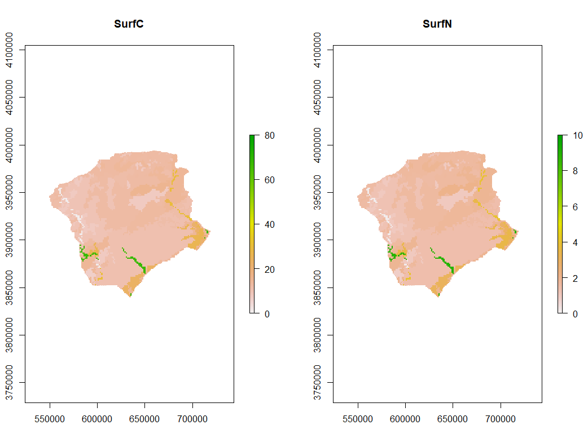
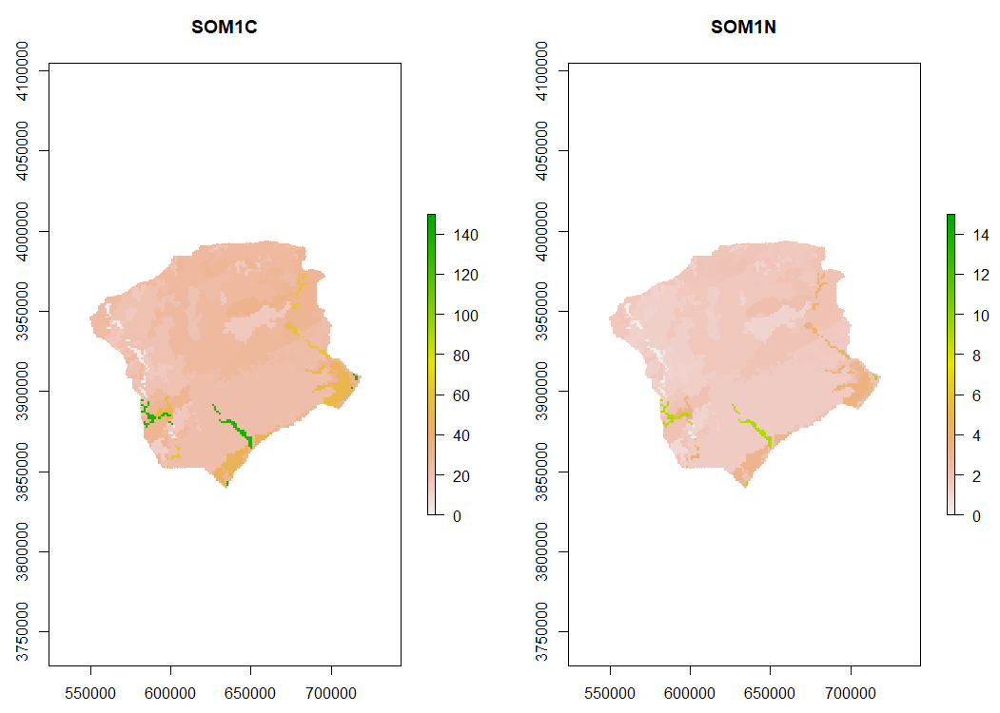
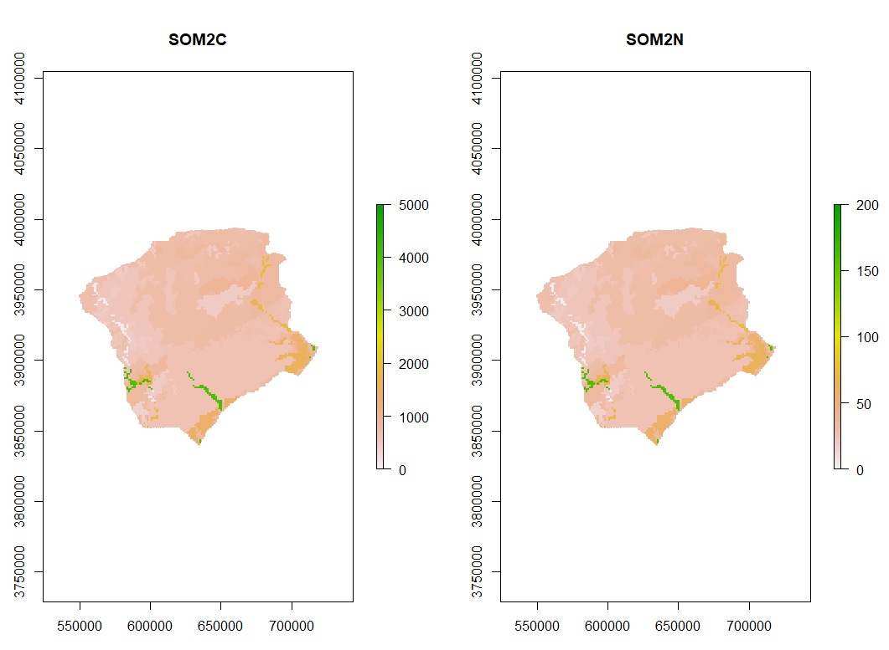
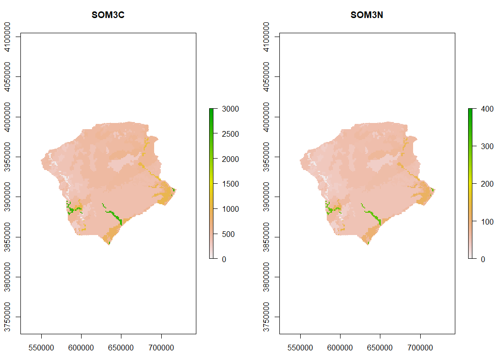

### Soils maps

The NECN succession extension requires input maps of landscape abiotic conditions. Maps for soil depth, drainage, flood frequency, sand and clay percentage, field capacity,
and wilting point were derived from the USGS gssurgo dataset and cropped to the study extent. These maps were aggregated from their original resolution (10m) to the study 
resolution of 100m. Total carbon was calculated using the CONUS level carbon maps scale to the resolution of the study area (West 2014). The guidelines in the Century 
manual were used to divide the SOM into the fast, slow, and passive pools and then calculate the total N in each pool (Parton 2013). Deadwood and roots were calculated by 
interpolating between FIA sites for dead wood and assuming dead roots made up 1/3 of dead wood values.

The methods for creating soils maps come from Melissa Lucash. Zachary Robbins was hugely helpful in the creation of these maps for the central North Carolina landscape.
I sincerely thank them both for their contributions.

NECN requires the following maps:

* Soil depth 1
* Soil drain 1
* Field capacity 1
* Wilting point 1
* Percent sand 1
* Percent clay 1
* Soil maps of carbon pools 2
* Soil maps of nitrogen pools 2
* Dead wood on the surface 3
* Dead wood of coarse roots 3
* Base flow to streams 4
* Storm flow to streams 4

Map 1s are derived from the USGS ggsurgo database. Map 2s are derived from total soil carbon maps (West 2014). Map 3s are interpolated from FIA data. 
BaseFlow and Storm Flow (Map 4s) are treated as stationary variables in this simulation.

#### Soil carbon and nitrogen
To create soil carbon and nitrogen maps for each soil pool, I reprojected and cropped West's (2014) total soil carbon map to the study extent. Based on Melissa Lucash's work, 
estimated ratios of carbon in each soil pool (surface, fast, medium and slow) as well as C:N ratios were used to create soil maps.

As a fraction of total carbon, each carbon pool is:
* SOM1surfC=.01 
* SOM1soilC=.02 
* SOM2C=.59 
* SOM3C=.38 

Each nitrogen map is then created by multiplying the carbon in the respective pool by:
* SOM1surfN=.1 
* SOM1soilN=.1 
* SOM2N=.04 
* SOM3N=.118 
A minimum value of 2.0 was set for the nitrogen value to avoid complete lack of N in some stands with low soil carbon.

These are the resulting maps:

#### Soil characteristics
Soil maps for feild capacity, wilting point, soil depth, soil drainage, flood frequency, and sand and clay percentages were created using the gssurgo and ssurgo database. 
ggsurgo is gridded to a 10m resolution which was aggreggated to 50m for processing.

ggsurgo works on a component and map key system, requiring attribute joins to create a map of a single trait. Four tables were joined to create the soil characteristics maps: 
the chorizon,component,conmonth, and corestriction tables.

Fields used key:

* Drainage = component:drainagecl
* Flood Frequency= conmonth:Flodfreqdcl
* Wiltpoint= chorizon:wfifteenbar:r
* Feild capacity= wthirdbar:r
* Sand Percentage= chorizon:sandtotal_R:RV
* Clay Percentage= chorizon:claytotal_R:RV
* Soil depth= corestriction:resdept_r

Drainage categories:
* Well= 1
*	Mod well= 1
*	Somewhat poor= 0.75
*	Poor= 0.5
*	Somewhat excessively= 1
*	Very poor= 0.25
*	Excessively= 1
*	Other= 1

These are the resulting maps:

#### Dead wood and roots
To calculate dead wood, each FIA plot in the study area within the last survey cycle was used. Using the total carbon down dead from the FIA data, we interpolated it to the 
whole study area. We assumed that dead coarse roots make up approximately a third of that value.

This is the deadwood map that resulted:

#### Notes on data formatting
Some additional steps were necessary to prepare the maps for LANDIS-II use.

* The data needs to be resampled to the same size and in the same projection as the initial communities file.
* Create a simple ecoregion for testing, find which files do not perfectly overlap with the ecoregion and assign the missing values a mean value.
* LANDIS-II requires sand and clay maps to have values be between 0 and 1.0. The USGS values are on a scale of 0-100, so we divded them by 100 for LANDIS-II compatability. 
* Soil depth values of zero can never grow trees and will trigger weird errors in the model. We found each cell with zero soil depth (usually a rocky outcrop) and turned that
cell in the ecoregion off.
* Wilt point cannot be greater field capacity in any given cell so a scaler was applied so that their difference was at least to 0.01

Sources: 
Parton, W. 2013. CENTURY Soil Organic Matter Model Environment. Technical Documentation. Agroecosystem Version 3.0. USDA-ARS, Forest Collins, CO.
West, T.O. 2014. Soil Carbon Estimates in 20-cm Layers to 1-m Depth for the Conterminous US, 1970-1993. Data set. Available on-line [http://daac.ornl.gov] from Oak Ridge National Laboratory Distributed Active Archive Center, Oak Ridge, Tennessee, USA. http://dx.doi.org/10.3334/ORNLDAAC/1238
Soil Survey Staff, Natural Resources Conservation Service, United States Department of Agriculture. Soil Survey Geographic (SSURGO) Database for NC. Available online. Accessed [10/17/2019].
