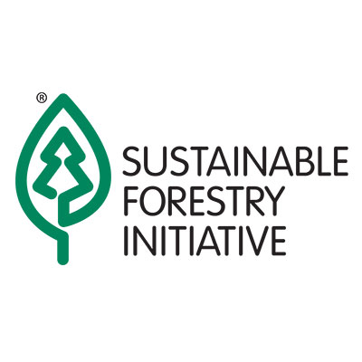

# Project-NC-Conservation-Global-Change

### Project Overview
Central North Carolina is an exceptionally active region for conservation. Containing the portions of the Atlantic Coastal Plain ecoregion, a global biodiversity hotspot (Noss et al. 2015); the Sandhills ecoregion, a hub of interagency conservation efforts to restore longleaf pine forests (Brockway et al. 2005); and the Piedmont ecoregion, where the Uwharrie National Forest has become the focus of longterm restoration planning (US Forest Service 2012); this area is of substantial interest to conservation NGOs and natural resource agencies across all levels of government. Yet rapid land use change and urbanization (Terando et al. 2014), coupled with climate change and shifting disturbance regimes (Mitchell et al. 2014), are changing landscape responses to conservation and challenging conventional approaches to management. 

A way to simulate the systematic, continuous, and dynamic implementation of conservation action that enables detailed performance assessment at the landscape scape is needed to inform conservation decision-making under uncertainty. Using a landscape change model, LANDIS-II, we have developed a new approach for testing conservation action effectiveness on a spatiotemporally dynamic landscape in central North Carolina across scenarios of climate and land use change. Our goal is to support effective and efficient conservation action under global change through rigorous in-silico assessment that illucidates the costs and benefits of management decisions at a scale relevant to practitioners.

People:
- Tina Mozelewski, North Carolina State University
- Robert Scheller, North Carolina State University
- Zachary Robbins, North Carolina State University

Thank you to our funders:

Citations:
1. Brockway, D.G., Outcalt, K.W., Tomczak, D.J., Johnson, E.E. (2005). Restoration of Longleaf Pine Ecosystems. Gen. Tech. Rep. GTR-SRS-83USDA For. Serv., Southern Res. Sta., Asheville, NC.
2. Mitchell, R.J., Liu, Y., O’Brien, J.J., Elliott, K.J., Starr, G., Miniat, C.F., Hiers, J.K. (2014). Future climate and fire interactions in the southeastern region of the United States. Forest Ecology and Management 327:316-326.
3. Noss, R.F., Platt, W.J., Sorrie, B.A., Weakley, A.S., Means, D.B., Costanza, J., Peet, R.K. (2015). How global biodiversity hotspots may go unrecognized: Lessons from the North American Coastal Plain. Diversity and Distributions 21:236-244.
4. Terando, A.J., Costanza, J., Belyea, C., Dunn, R.R., McKerrow, A.J., Collazo, J.A. (2014). The Southern megalopolis: using the past to predict the future of urban sprawl in the Southeast US. PLoS ONE 9:e102261.
5. U.S. Department of Agriculture Forest Service. (2012). Uwharrie National Forest Land and Resource Management Plan. https://www.fs.usda.gov/Internet/FSE_DOCUMENTS/stelprdb5367130.pdf
